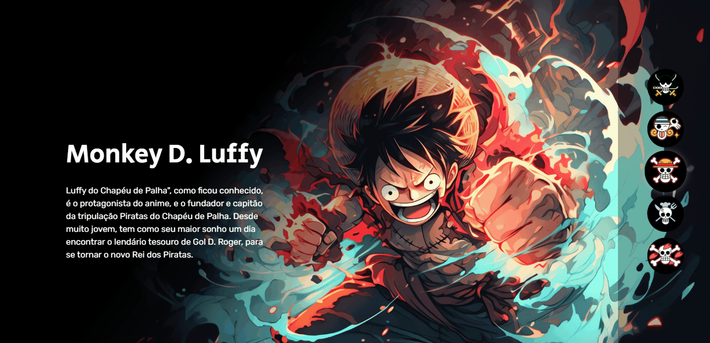

## Projeto "One Piece"

Este projeto faz parte da "Semana do Zero ao Programador Contratado", uma iniciativa promovida pelo canal "Dev em Dobro". O objetivo é desenvolver um website para apresentar informações sobre os personagens do anime "One Piece". Cada personagem terá uma breve descrição para fornecer aos fãs uma rápida introdução a seus perfis e histórias.

Link de acesso: https://emilaynerodrigues.github.io/one-piece/

## Funcionalidades Principais

1. **Apresentação de Personagens**: Listagem dos personagens de "One Piece" com suas respectivas imagens e nomes.
   
2. **Breve Descrição dos Personagens**: Exibição de uma breve descrição sobre cada personagem ao clicar em suas respectivas seções.

## Tecnologias Utilizadas

- **HTML**: Para estruturação e marcação do conteúdo.
- **CSS**: Para estilização e apresentação visual do site.
- **JavaScript**: Para interatividade e dinamismo no carregamento e navegação do conteúdo.

- ## Demonstração

